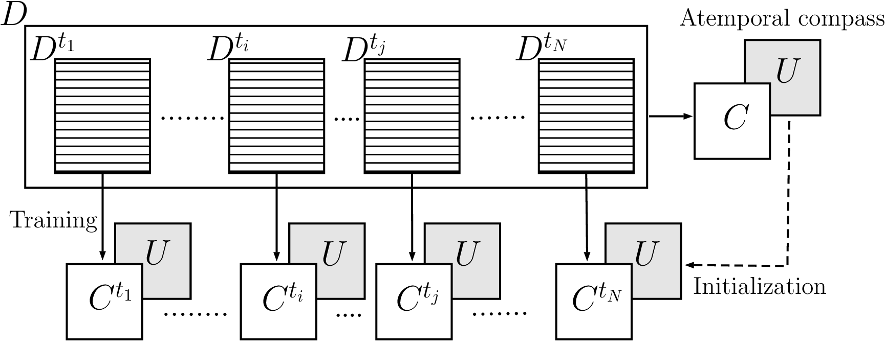

=========================================================
TWEC: Temporal Word Embeddings with a Compass (AAAI 2019)
=========================================================

This package contains Python code to build temporal word embeddings with a compass!
One of the problems of temporal word embeddings is that they require alignment between corpora.
We propose a method to aligned distributional representation based on word2vec.
This method is efficient and it is based on a simple heuristic: we train an atemporal word embedding, **the compass**
and we use this embedding to freeze one of the layers of the CBOW architecture.

we freeze one layer of the CBOW architecture and train
temporal embedding on the other matrix. See the `paper
<https://aaai.org/ojs/index.php/AAAI/article/view/4594>`_ for more details.

Reference
---------

This work is based on the following paper (`Link
<https://aaai.org/ojs/index.php/AAAI/article/view/4594>`_.)

+ Di Carlo, V., Bianchi, F., & Palmonari, M. (2019). **Training Temporal Word Embeddings with a Compass**. Proceedings of the AAAI Conference on Artificial Intelligence, 33(01), 6326-6334. https://doi.org/10.1609/aaai.v33i01.33016326

Abstract
--------

Temporal word embeddings have been proposed to  support the analysis of word meaning shifts during time and to study
the evolution of languages. Different approaches have been proposed to generate vector representations of words that
embed their meaning during a specific time interval. However, the training process used in these
approaches is complex, may be inefficient or it may require large text corpora.  As a consequence,
these approaches may be difficult to apply in resource-scarce domains or by scientists with
limited in-depth knowledge of embedding models. In this paper, we propose a new heuristic to train
temporal word embeddings based on the Word2vec model.
The heuristic consists in using atemporal vectors as a reference, i.e., as a compass, when training the representations specific
to a given time interval. The use of the compass simplifies the training process and makes it more efficient.
Experiments conducted using state-of-the-art datasets and methodologies suggest that our approach outperforms or
equals comparable approaches while being more robust in terms of the required corpus size.

Installing
----------

**Important**: always create a virtual environment because TWEC uses a custom version of the gensim library.

* clone the repository
* :code:`virtualenv -p python3.6 env`
* :code:`source env/bin/activate`
* :code:`pip install cython`
* :code:`pip install git+https://github.com/valedica/gensim.git`
* cd in repository
* :code:`pip install -e .`

**Jupyter**: you can use this in a jupyter-notebook, but remember that you need the virtual environment!
In the following the commands you need to use, but for a more detailed description of what we are doing see this `link
<https://anbasile.github.io/programming/2017/06/25/jupyter-venv/>`_.

* you need to install the virtual environment inside jupyter
* :code:`source env/bin/activate`
* :code:`(venv) $ pip install ipykernel`
* :code:`(venv) $ ipython kernel install --user --name=twec_kernel`
* you will find the "twec_kernel" when you create a new notebook

Guide
-----

* **Remember**: when you call the training method of :code:`TWEC` the class creates a "model/" folder where it is going to save the trained objects. The compass will be trained as first element and it will be saved in that folder. If you want to overwrite it remember to set the parameter :code:`overwrite=True`, **otherwise** it will reload the already trained compass.

* **What do you need**: temporal slices of text (i.e., text from 1991, text from 1992, etc...) and the concatenation of those text slices (the compass).

* **The compass** should be the concatenation of the slice you want to align. In the next code section you will see that we are going to use arxiv papers text from two different years. The "compass.txt" file contains the concatenation of both slices.

How To Use
----------

* Training

Suppose you have two slices of temporal text "arxiv_14.txt" and "arxiv_9.txt". First of all, create the concatenation
of these two and create a "compass.txt" file. Now you can train the compass.

.. code-block:: python

    from twec.twec import TWEC
    from gensim.models.word2vec import Word2Vec

    aligner = TWEC(size=30, siter=10, diter=10, workers=4)

    # train the compass: the text should be the concatenation of the text from the slices
    aligner.train_compass("examples/training/compass.txt", overwrite=False) # keep an eye on the overwrite behaviour
..

You can see that the class covers the same parameters the Gensim word2vec library has. "siter" refers to the compass
training iterations while "diter" refers to the training iteration of the specific temporal slices.
After this first training you can train the slices:

.. code-block:: python

    # now you can train slices and they will be already aligned
    # these are gensim word2vec objects
    slice_one = aligner.train_slice("examples/training/arxiv_14.txt", save=True)
    slice_two = aligner.train_slice("examples/training/arxiv_9.txt", save=True)
..

These two slices are now aligned and can be compared!

* Load Data

You can load data has you do with gensim.

.. code-block:: python

    model1 = Word2Vec.load("model/arxiv_14.model")
    model2 = Word2Vec.load("model/arxiv_9.model")
..

People
------

+ Valerio Di Carlo
+ Federico Bianchi (federico.bianchi@unimib.it)
+ Matteo Palmonari (matteo.palmonari@unimib.it)

Credits
-------

This package was created with Cookiecutter_ and the `audreyr/cookiecutter-pypackage`_ project template.

.. _Cookiecutter: https://github.com/audreyr/cookiecutter
.. _`audreyr/cookiecutter-pypackage`: https://github.com/audreyr/cookiecutter-pypackage
